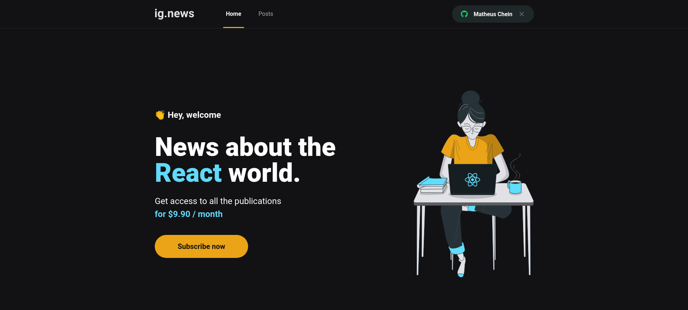

<p align="center">
  
</p>

<p align="center">
  

  

  
  
  

</p>

<h1 align="center">
    
</h1>

<hr>

<p align="center">
  <a href="#dart-about">About</a> &#xa0; | &#xa0; 
  <a href="#sparkles-features">Features</a> &#xa0; | &#xa0;
  <a href="#rocket-technologies">Technologies</a> &#xa0; | &#xa0;
  <a href="#white_check_mark-requirements">Requirements</a> &#xa0; | &#xa0;
  <a href="#checkered_flag-starting">Starting</a> &#xa0; | &#xa0;
  <a href="#memo-license">License</a> &#xa0; | &#xa0;
  <a href="https://github.com/MatheusChein" target="_blank">Author</a>
</p>

<br>

## :dart: About ##

Ignews - App developed in React and NextJs to share posts about the React World.

## :sparkles: Features ##

:heavy_check_mark: Authentication with next-auth, using Github;\
:heavy_check_mark: Integration with Stripe for payments and subscriptions;\
:heavy_check_mark: Server Side Rendering;\
:heavy_check_mark: Static Site Generation;\
:heavy_check_mark: Prismic CMS to create the posts;\
:heavy_check_mark: FaunaDB for serverless database;\
:heavy_check_mark: Posts previews if user is not susbcribed, to enhance SEO;


## :rocket: Technologies ##

The following tools were used in this project:

- [React](https://pt-br.reactjs.org/)
- [NextJs](https://nextjs.org/)
- [SASS](https://sass-lang.com/)
- [TypeScript](https://www.typescriptlang.org/)
- [Prismic](https://prismic.io/)
- [FaunaDB](https://fauna.com/)
- [Stripe](https://stripe.com/en-br)

## :white_check_mark: Requirements ##

Before starting :checkered_flag:, you need to have [Git](https://git-scm.com) and [Node](https://nodejs.org/en/) installed. Also, you need an account on the services mentioned, such as Prismic, Stripe and FaunaDB.

## :checkered_flag: Starting ##

```bash
# Clone this project
$ git clone https://github.com/MatheusChein/ignews.git

# Access
$ cd letmeask-React

# Install dependencies
$ yarn

# Run the project
$ yarn dev

# The server will initialize in the <http://localhost:3000>
```

## :memo: License ##

This project is under license from MIT. For more details, see the [LICENSE](LICENSE.md) file.

Made with :heart: by <a href="https://github.com/MatheusChein" target="_blank">Matheus Chein</a>

&#xa0;

<a href="#top">Back to top</a>
